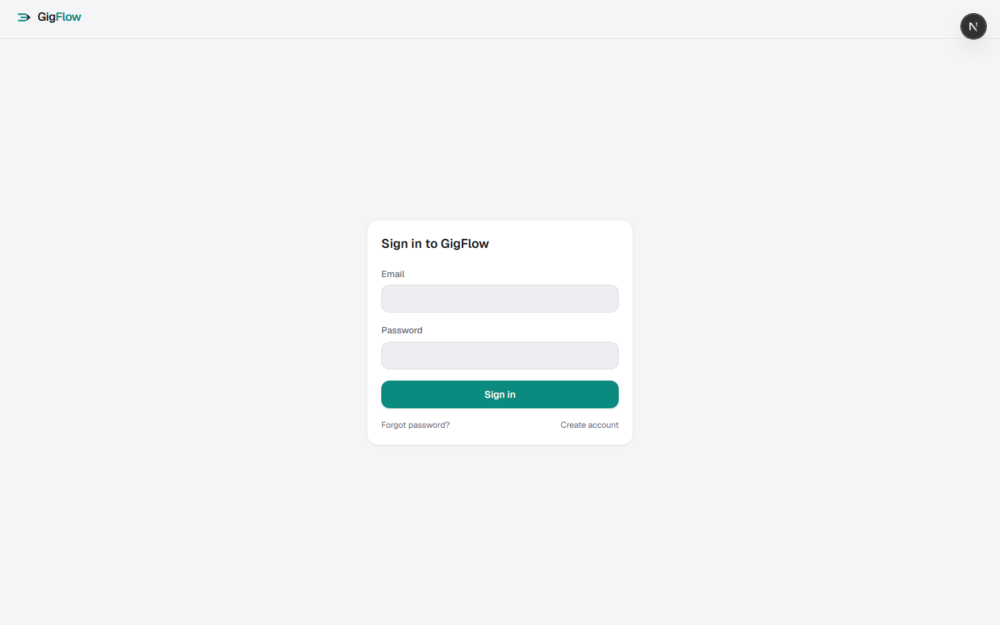

<div align="center">


# GigFlow

**Your gig work. One flow.**

Track earnings, expenses, and mileage. Score incoming offers against your own
rules. Plan when and where to work. See what your time is actually worth —
across every platform you drive for.

[](LICENSE)
[](web)
[](android)
[](https://ko-fi.com/w0wzahh)

</div>

---

## What it is

GigFlow is an **independent, open-source workspace for rideshare and delivery
drivers** — a free alternative to paid driver-assistant apps. It has two parts:

- **Web app** (`web/`) — a full Next.js platform: dashboard, earnings, expenses,
  mileage, offers, rules, schedule, analytics, goals, CSV/Gmail import.
- **Android companion** (`android/`) — an iOS-styled Kotlin app that watches
  driver apps via `AccessibilityService`, scores each offer on-screen, and can
  auto-accept or auto-decline based on your rules. Optional GPS shift tracking,
  activity heatmap, voice alerts, and post-trip earnings capture.

> GigFlow is not affiliated with, endorsed by, or connected to Uber, Lyft,
> DoorDash, Wolt, foodora, or any other platform. No platform provides a public
> driver-facing API — see [Integrations](#integrations--honest-by-design) for
> exactly how data gets in.

## Features

**Workspace (web)**
- Earnings, expenses, and mileage logging with per-platform breakdowns
- $/hour and $/distance analytics — weekly, monthly, daily chart
- Goals, insights, schedule planning, offer history
- CSV statement import + optional Gmail receipt sync
- PWA-installable on iOS and Android browsers

**Companion app (Android)**
- Reads offer cards on-screen in Uber, Lyft, DoorDash, Instacart, Amazon Flex,
  Spark, Wolt, and foodora — scores them against *your* rules instantly
- Floating verdict overlay with **auto-accept countdown** (3/5/8/10s) and
  auto-decline — both opt-in, both cancellable
- **Per-app rule overrides** — different thresholds per platform
- **Automatic GPS mileage** — a foreground "shift" tracker with jitter/teleport
  filtering; optionally starts itself when a driver app opens
- **Automatic earnings capture** — post-trip summary screens become earning
  records, no typing
- **Activity heatmap** — OpenStreetMap-based map of where *your* work happens
- Reservation detection, voice alerts, offline-first local storage, web sync

## Screenshots

<div align="center">
<table>
  <tr>
    <td></td>
    <td></td>
    <td></td>
    <td></td>
  </tr>
  <tr>
    <td align="center"><sub>Dashboard</sub></td>
    <td align="center"><sub>Track + shift mileage</sub></td>
    <td align="center"><sub>Plan + activity heatmap</sub></td>
    <td align="center"><sub>Assistant rules</sub></td>
  </tr>
</table>

</div>

## Quick start

**Web app**

```bash
cd web
cp ../.env.example .env     # set APP_SECRET
npm install                 # runs prisma generate via postinstall
npx prisma migrate dev      # create + migrate prisma/dev.db
npm run db:seed             # seed the platform catalog
npm run dev                 # http://localhost:3000
```

Generate a real secret for anything beyond local dev:

```bash
node -e "console.log(require('crypto').randomBytes(32).toString('hex'))"
```

**Android companion** — grab the APK from
[Releases](https://github.com/w0wzahh/GigFlow/releases), or build it:

```bash
cd android
gradle assembleDebug      # outputs app/build/outputs/apk/debug/app-debug.apk
```

Then: enable the accessibility service (Assist tab → Setup), optionally grant
location + overlay permissions for auto-shift tracking and the verdict overlay,
and link sync via **Settings → Security → Android companion app** on the web.

## Stack

| Layer | Choice | Why |
|---|---|---|
| Web | Next.js 16 (App Router) + React 19, TypeScript strict | SSR + route handlers |
| Data | Prisma 6 + SQLite (dev), Postgres-ready | zero-service local dev |
| Auth | Custom: scrypt passwords + opaque session cookies | no provider lock-in |
| Validation | Zod at every API boundary | shared schemas |
| Tests | Vitest (unit + DB integration), Playwright (e2e) | fast loop + real flows |
| Android | Kotlin, Views (hand-rolled iOS-style design system) | near-zero dependencies |
| Map | osmdroid + OpenStreetMap tiles | no API key, cacheable |

## Project structure

```
web/               the Next.js app — all web commands run inside this folder
  prisma/          schema + migrations + seed
  src/app/         routes: (marketing), (auth), (app), api/, onboarding/
  src/lib/         auth, integrations, rules engine, metrics, import
  tests/           unit, integration, e2e
android/           GigFlow Driver — Kotlin companion app
  app/src/main/    accessibility service, mileage tracker, overlay, UI
docs/              architecture, API, integrations, database notes
scripts/           repo tooling
```

## Integrations — honest by design

No gig platform offers a public driver-facing API, so GigFlow ships three real
paths instead of fake connections:

- **CSV statement import** — parses platform earnings exports with column
  auto-detection and idempotent `importKey` dedupe.
- **Gmail receipt sync** — optional read-only OAuth; turns Uber/Lyft
  trip-receipt emails into earnings.
- **Android accessibility service** — reads offer cards on-screen, locally and
  only in the apps you watch.

Everything else is manual tracking, clearly labeled. Details:
[`docs/integrations.md`](docs/integrations.md).

## Privacy & safety

- Screen content never leaves the phone — only distilled offer fields sync,
  and only if you configure it
- GPS breadcrumbs stay on-device; the heatmap is built from *your* activity only
- Automation (accept/decline, mileage, earnings capture) is opt-in and off or
  clearly switchable
- scrypt-hashed passwords, SHA-256 session tokens, per-user scoping, rate limits

## Testing

```bash
cd web
npm test                # vitest — unit + integration
npm run typecheck       # tsc --noEmit
npm run lint            # eslint
npm run test:e2e        # playwright
```

## Contributing

Issues and PRs welcome — see [CONTRIBUTING.md](CONTRIBUTING.md).

## License

[MIT](LICENSE) — free to use, fork, and build on.

---

<div align="center">
Made by <a href="https://github.com/w0wzahh">w0wzahh</a> ·
<a href="https://ko-fi.com/w0wzahh">Support on Ko-fi</a>
</div>
