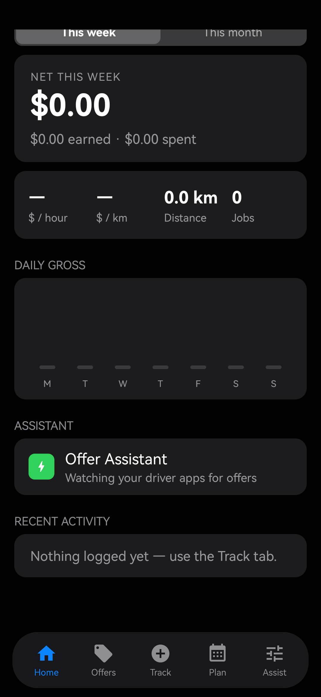
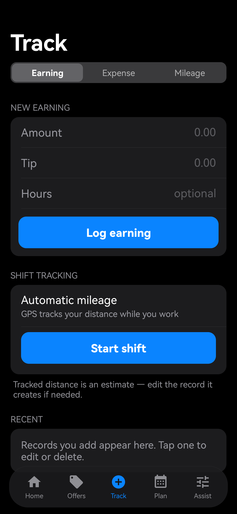
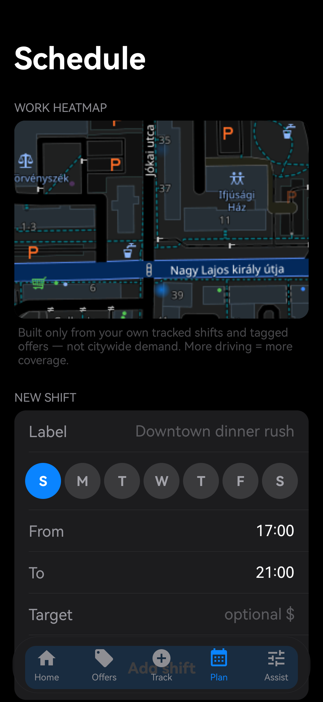
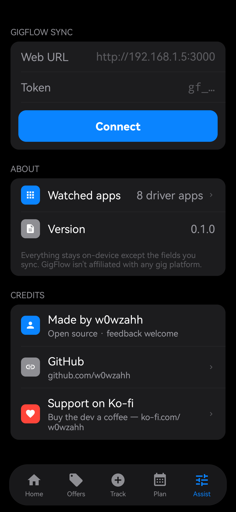

<div align="center">


# GigFlow

**Your gig work. One flow.**

An open-source Android app for rideshare and delivery drivers: reads offers
on-screen, scores them against your rules, optionally accepts or declines for
you, and tracks the rest of your work automatically — mileage, earnings, and
where you actually drive.

[](LICENSE)
[](android)
[](https://github.com/w0wzahh/GigFlow/releases)
[](https://ko-fi.com/w0wzahh)

</div>

---

## What it is

GigFlow Driver is a **free, open-source alternative to paid driver-assistant
apps** like Mystro. It uses Android's accessibility APIs — the same approach
the paid apps use — to watch the driver apps you choose, read each offer card
as it appears, score it against thresholds you set, and show a floating
verdict. Enable automation and it can accept the good ones (on a cancellable
countdown) or decline the bad ones — hands-free.

Everything runs on-device. No account required, no subscription, no tracking.

> GigFlow is not affiliated with, endorsed by, or connected to Uber, Lyft,
> DoorDash, Wolt, foodora, or any other platform. All names are trademarks of
> their owners, used only to identify compatibility.

## Features

- **On-screen offer scoring** — watches Uber Driver, Lyft Driver, Dasher,
  Instacart Shopper, Amazon Flex, Spark Driver, Wolt Courier Partner, and
  foodora rider; reads payout, distance, duration; scores against your rules
- **Floating verdict overlay** — GOOD OFFER / BORDERLINE / SKIP IT with
  $/distance and $/hour, plus tap-to-accept and tap-to-decline shortcuts
- **Opt-in automation** — auto-accept on a 3/5/8/10s countdown you can
  cancel, auto-decline, voice alerts. Off by default; you're in control
- **Per-app rules** — different thresholds per platform (Wolt can have a
  lower bar than Uber); reserved/scheduled offers are detected and handled
  separately
- **Automatic GPS mileage** — a foreground "shift" tracker with jitter and
  teleport filtering; can start itself when a driver app opens
- **Automatic earnings capture** — post-trip summary screens become earning
  records without typing anything
- **Diagnostics** — see exactly what the assistant last read inside each
  driver app, so parse misses are debuggable instead of silent
- **Self-updating** — checks GitHub Releases for a newer APK (at most once
  per 6h) and installs it through the system installer when you confirm
- **100% local** — every record lives in on-device SQLite; the only
  network call is the anonymous GitHub update check

## Screenshots

<div align="center">
<table>
  <tr>
    <td></td>
    <td></td>
    <td></td>
    <td></td>
  </tr>
  <tr>
    <td align="center"><sub>Dashboard</sub></td>
    <td align="center"><sub>Track + shift mileage</sub></td>
    <td align="center"><sub>Schedule</sub></td>
    <td align="center"><sub>Assistant rules</sub></td>
  </tr>
</table>
</div>

## Install

Grab the latest APK from
[Releases](https://github.com/w0wzahh/GigFlow/releases) — Android 8.0+.

Setup takes under a minute — the app walks you through it in the Assist tab:

1. **Enable the accessibility service** (required — this is what lets
   GigFlow see offer cards in your driver apps)
2. **Allow location** (for automatic mileage tracking)
3. **Allow notifications** (the shift tracker runs as a foreground service)

Then open a driver app and watch the verdict card appear on offers.
Automation is off by default — enable it in **Assist → Automation** when
you're ready.

Or build it yourself:

```bash
cd android
# android/local.properties must point at your SDK:
#   sdk.dir=C:/Users/<you>/AppData/Local/Android/Sdk
gradle assembleDebug   # → app/build/outputs/apk/debug/app-debug.apk
```

## How it works

- **Accessibility service** scoped to the watched driver-app packages —
  it can't see anything else on your phone
- **Heuristic text parsing** of offer cards (layout-independent, but
  layouts change — Diagnostics shows what it read when a screen is missed)
- **`dispatchGesture` taps** for accept/decline — only when you enable it,
  only inside the driver apps you watch
- **Foreground location service** for shift mileage — visible in the
  notification shade the whole time it runs
- **GitHub Releases updater** — one anonymous GET to `api.github.com` to
  check for a newer version; the APK installs via the system installer
  (you confirm, Android asks "allow this source" once)

## Project structure

```
android/           the app — Kotlin, plain Views, near-zero dependencies
  app/src/main/
    java/.../      accessibility service, mileage tracker, parser, overlay,
                   rule engine, local DB, iOS-style UI
    res/           icons, service config, strings
docs/              legal docs, screenshots, notes
```

## Honest limitations

- **Not an official integration.** No gig platform publishes a driver API;
  this reads what's on screen, like every app in this category.
- **Heuristic parsing.** Driver apps change layouts; if a card can't be
  read, GigFlow errs toward silence and never guesses at buttons.
- **Automation is opt-in** and only fires when a button was found
  unambiguously.
- **Policy note.** Third-party assistants may conflict with gig platforms'
  terms — your call.

## Privacy

Screen content never leaves the phone — the only network traffic is the
anonymous update check against GitHub. Automation is
opt-in and cancellable. Full details:
[`docs/legal/privacy-policy.md`](docs/legal/privacy-policy.md).

## Contributing

Issues and PRs welcome — see [CONTRIBUTING.md](CONTRIBUTING.md). The most
useful contributions are offer-parser fixes: driver apps change layouts
constantly.

## License

[MIT](LICENSE) — free to use, fork, and build on.

---

<div align="center">
Made by <a href="https://github.com/w0wzahh">w0wzahh</a> ·
<a href="https://ko-fi.com/w0wzahh">Support on Ko-fi</a>
</div>
